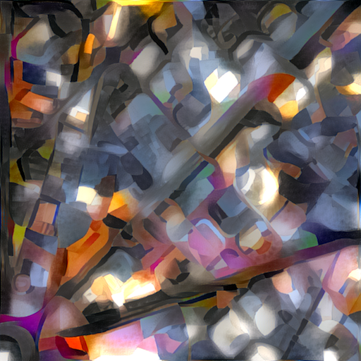

# Neural Style for Docker
__Satellite imagery edition!__


_Barcelona's Eixample district in the style of Francis Picabia's "Ecclesiastical"_

A dockerized (by [Álvaro Barbero Jiménez](https://github.com/albarji/neural-style-docker)) version of the [neural style algorithm by jcjohnson](https://github.com/jcjohnson/neural-style). [nvidia-docker](https://github.com/NVIDIA/nvidia-docker) is optimized for GPU hardware.

## Install

### Prerequisites

* [docker](https://www.docker.com/)
* [nvidia-docker](https://github.com/NVIDIA/nvidia-docker)
* Appropriate nvidia drivers for your GPU

### Installation

You can either pull the Docker image from Docker Hub with

`docker pull wboykinm/neural-style`

or build the image locally with

`make`
	
or spin up an EC2 (warning; these GPU instances can get expensive)

```
# create:
docker-machine create \
	--driver amazonec2 \
	--amazonec2-instance-type p2.xlarge \
	--amazonec2-access-key $AWS_ACCESS_KEY \
	--amazonec2-secret-key $AWS_SECRET_KEY \
	--amazonec2-subnet-id $AWS_SUBNET_ID \
	--amazonec2-vpc-id $AWS_VPC_ID \
	nvidia-mapper # name your machine

# . . . and connect:
docker-machine ssh nvidia-mapper
```

## Simple use

`bash scripts/fake-it.sh <params>`

This applies a blend of content and style with some default parameters. Both content and style images must be present in the "contents" and "styles" folders, respectively.

Example: to draw the downtown Sydney in the style of Picabia's "Ecclesiastical", run

`bash scripts/fake-it.sh digitalglobe/_0003_AUS_Sydney_Jan06_2015_WV3_30cm.jpg picabia_ecclesiastical.jpg`

## Advanced use

### Processing tiled maps

Pull satellite imagery tiles from the Mapbox API for a given bbox and zoom level:
`bash get_tiles.sh <bbox geojson> <z>`

e.g.
`bash get_tiles.sh vergennes.geojson 11`

Then loop through the results:
```
for i in $(ls scripts/tiles/tmptiles/); do
  bash scripts/style-tiles.sh $i picabia_ecclesiastical.jpg 512
done
```

### Generating variants

Running the command script

`bash scripts/variants.sh`

will generate several variants of the same image blends, for different neural-style parameters that work well in general. This is useful for producing several versions of the same blend and afterwards hand-picking the best one. Run this command with the -h option to obtain usage help.

For example, to generate different variants of Docker logo + Starry Night:

`bash scripts/variants.sh --contents contents/docker.png --styles styles/vangogh.jpg`

### Use as the neural-style command

You can directly invoke the core neural-style algorithm by simply running a container of this image, for example:

`nvidia-docker run --rm wboykinm/neural-style -h`

produces the usage help.

To apply the neural-style method on some host images, map the host folder with such images to the container /images folder through a volume such as

`nvidia-docker run --rm -v $(pwd):/images wboykinm/neural-style -backend cudnn -cudnn_autotune -content_image content.png -style_image style.png`

The container uses as work directory the /images folder, so the results will be readily available at the mounted host folder.

In order to take full advantage of the cudnn libraries (also included in the image) the options -backend cudnn -cudnn_autotune are always recommended.

As an example, let's redraw Docker's logo in the famous style of Van Gogh's Starry Night:

`nvidia-docker run --rm -v $(pwd):/images wboykinm/neural-style -backend cudnn -cudnn_autotune -content_image contents/docker.png -style_image styles/vangogh.jpg`


